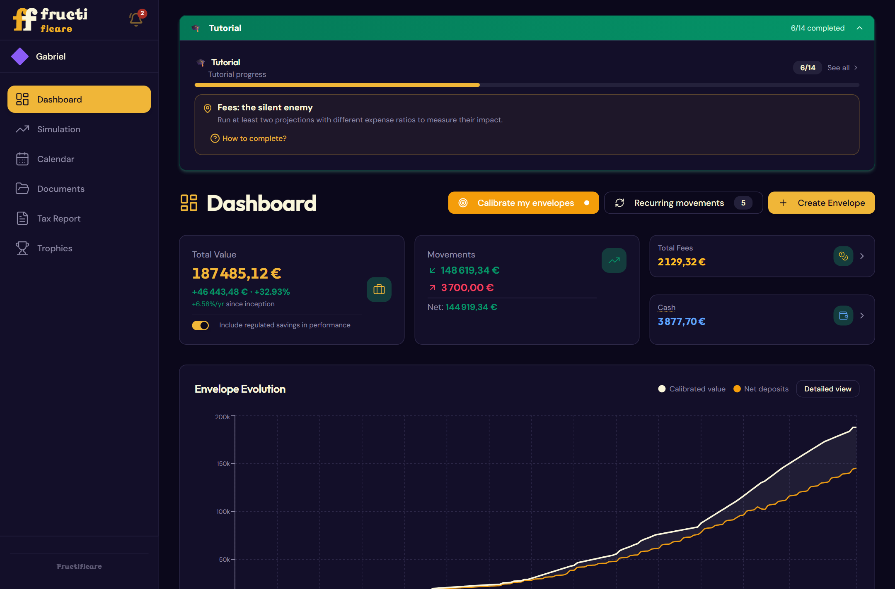
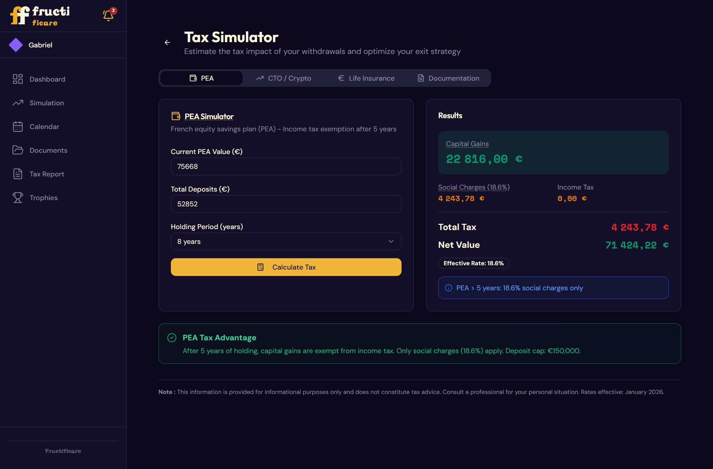
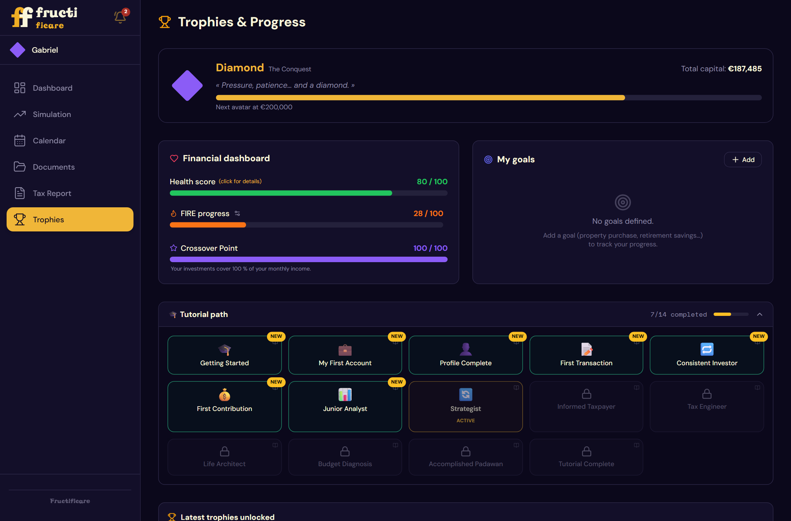

# Fructificare

**Offline portfolio tracker and simulator for French investors** (PEA, brokerage account,
life insurance, PER, regulated savings accounts).

**Website: [fructificare.fr](https://fructificare.fr/en/)** · *Français : [LISEZMOI.md](LISEZMOI.md).*

[](https://github.com/astarat-code/fructificare/actions/workflows/ci.yml)
[](LICENSE)
[](https://fructificare.fr/en/)

**100% local.** No account, no server, no telemetry. The application makes no network
request for any of its features — fonts and the user manual are embedded in the binary,
and that absence is checked mechanically on every build.



| Tax simulator | Trophies & progress |
|---|---|
|  |  |

*Every screenshot uses a fictional portfolio, generated by
`docs/manuel/demo/generer-jeu-fictif.js`.*

---

## Why local, and without a cloud

A portfolio tracker knows more about you than your bank does: how much you own, where,
since when, what you earn and what you plan. Fructificare is built so that this never
leaves your machine.

- **No account, no server.** Nothing to sign up for, nothing to trust with your data.
- **No network request at all.** Fonts and the manual are embedded; `npm run check:build`
  fails the build if a remote resource appears.
- **Minimal disk access.** The application can only read and write in its own folders; any
  other file has to be picked by you in a native dialog.
- **Your data stays a file you own.** A readable JSON backup, which you can export, move,
  encrypt, or read with any text editor. No lock-in, no export fee, no shutdown risk.

The trade-off is deliberate: no automatic sync between machines, and no fetching of your
bank balances. Both would mean sending your credentials somewhere.

---

## Install

Download the file for your system from [fructificare.fr](https://fructificare.fr/en/), or directly from the
[latest release](https://github.com/astarat-code/fructificare/releases/latest):

| System | File | |
|---|---|---|
| **Windows** 10 and 11 | `Fructificare_…_x64-setup.exe` | installs for the current user, without administrator rights |
| **Linux** | `Fructificare_…_amd64.AppImage` | any distribution: make it executable, then run it (Ubuntu 24.04+: install `libfuse2` first) |
| | `Fructificare_…_amd64.deb` | Debian, Ubuntu and derivatives |
| **macOS** 11+ — *experimental* | `Fructificare_…_universal.dmg` | Intel and Apple Silicon; drag Fructificare into Applications |

Releases are **not code-signed**. Windows SmartScreen warns you the first time (*More info →
Run anyway*). On macOS, the first launch is blocked until you click *Open Anyway* in *System
Settings → Privacy & Security*. The macOS version is so far tested only by the CI: reports
from Mac users are very welcome.

The published SHA-256 fingerprint is how you check the file is the one that was built:

```bash
Get-FileHash .\Fructificare_*_x64-setup.exe -Algorithm SHA256   # Windows (PowerShell)
sha256sum -c SHA256SUMS.txt --ignore-missing                      # Linux
shasum -a 256 Fructificare_*.dmg                                  # macOS
```

Compare it with `SHA256SUMS.txt`, published next to each release. Those fingerprints are
computed by the public CI, whose build log anyone can read — not on a maintainer's machine.

---

## Features

- **Dashboard** — every envelope in one view, with calibrated value and real returns.
- **Envelopes** — deposits, withdrawals, cash pocket, fees, per-asset notes.
- **Asset types** — allocation and performance by category.
- **Simulations** — long-term projection, 8-4-3 rule, stress test, FIRE target.
- **Calendar** — monthly budget, scheduled movements, calibration reminders.
- **Tax report** — PDF export for the French income tax return.
- **Progress** — trophies, quests and a financial health score.

The interface is available in French and English (FR/EN button in the sidebar), and so is
the 82-page user manual, opened from `Help → User manual`.

---

## Where your data lives

Everything lives in one application folder, with two subfolders: `save` (automatic
backups, the last 10) and `documents imp` (imported PDF documents).

| System | Application folder |
|---|---|
| Windows | `%APPDATA%\app.fructificare.desktop\` |
| Linux | `~/.local/share/app.fructificare.desktop/` |
| macOS | `~/Library/Application Support/app.fructificare.desktop/` |

Backups are JSON files, **in plain text by default**, so any program running under your
user account can read them. You can encrypt them with a passphrase:
`Settings → Security → Encrypt my backups`. It will then be asked every time Fructificare
opens — and **it cannot be reset**: if you forget it, the data is unrecoverable.

- **Export regularly** with `File → Export a backup…` (or `Ctrl+S`, `⌘S` on macOS).
- On Windows 11, `Documents`, `Desktop` and `Downloads` are often synchronized to OneDrive.
  Exporting an unencrypted backup there sends your finances to the Microsoft cloud. Prefer
  a local folder or an encrypted container (BitLocker, VeraCrypt).

To restore: `File → Import a backup…`

---

## Security and privacy

The application grants itself deliberately minimal disk access: it can only read and write
inside its own folders. Any other file is reachable only if you pick it yourself in a native
dialog. A strict Content-Security-Policy forbids inline and remote scripts, and the window
cannot navigate outside the local interface.

[`SECURITY.md`](SECURITY.md) holds the full threat model, what the software does *not*
protect against, and how to report a vulnerability.

---

## Build it yourself

Node.js 20 and Rust are the only prerequisites. See [`CONTRIBUTING.md`](CONTRIBUTING.md)
for the development setup, the test suites and the build.

**Prerequisites:** Node.js 20 LTS and Rust, plus the system libraries of your platform —
MSVC C++ Build Tools and WebView2 on Windows, WebKitGTK on Linux, Xcode Command Line Tools
on macOS (details in `CONTRIBUTING.md`). Each system builds its own application.

```bash
cd frontend
npm ci
npm run build          # web interface
npm run tauri build    # desktop application for the current system
```

---

## Status and roadmap

**v1.1.0 — Linux and macOS.** The application is feature-complete and used daily, but it
has only run on a handful of machines. Windows and Linux are supported; the macOS version is
experimental until Mac users have tried it. Expect rough edges, and please report them.

What is planned, in order:

- **Signed binaries.** SmartScreen warnings and hash checking are a poor experience; a
  free certificate for open source projects (SignPath Foundation) is the target.
- **Distribution through winget**, so that installing and updating is one command.
- **More asset types and tax cases**, driven by what users actually hold.

Ideas and votes are welcome in the [issues](https://github.com/astarat-code/fructificare/issues).

---

## Not financial advice

Fructificare is an information tool. It gives no investment advice and places no orders.
Tax calculations follow the French rules in force in January 2026 and are estimates — they
do not replace an official tax return, an accountant or a wealth management adviser.

---

## License

[AGPL-3.0-or-later](LICENSE). You may use, study, modify and redistribute this software,
provided modified versions stay under the same license.

Progress avatars reuse icons from [Phosphor Icons](https://phosphoricons.com) (MIT,
© 2023 Phosphor Icons) and the "dragon" icon from [Font Awesome Free](https://fontawesome.com)
(CC BY 4.0, © Fonticons, Inc.). The license notices sit next to the paths, in
`frontend/src/components/gamification/avatarIcons.js`.
